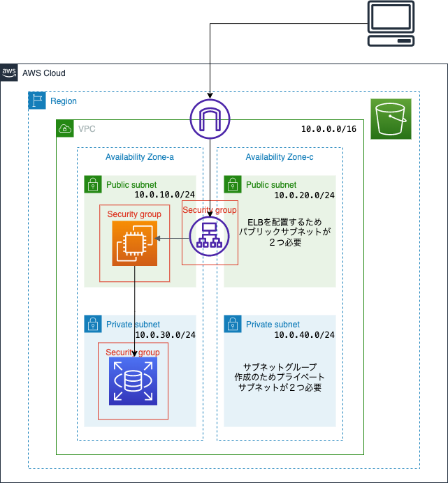

# Railsアプリケーションの実行環境構築　　
１．構成図  

2.リソース  
- VPC  
    - VPCを作成  
    - インターネットゲートウェイを作成  
    - インターネットゲートウェイをアタッチ  
    - 
- パブリックサブネット（ELB作成のため2つ作成 1a/1c）　　
- プライベートサブネット（RDSサブネットグループ作成のため2つ作成 1a/1c）　　
- インターネットゲートウェイ　　
- ルートテーブル
- IAMロール　　
- EC2　　
- セキュリティグループ　　
- RDS　　　　
- S3　　

