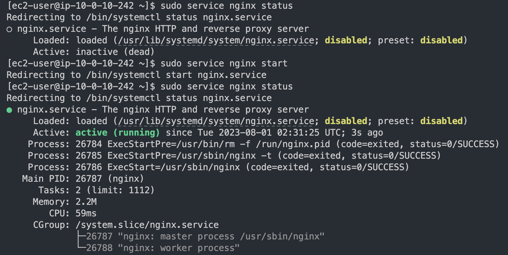

# Cloudformationを使ったリソース構築とサーバーテストの実行
### 概要
* Cloudformationを使用して、AWSリソースの作成からServerspecでのテスト実装。以下のツールを使用しています。
  * Cloudformation
  * Serverspec

## 各ディレクトリの内容

* [cloudformation/](https://github.com/shino-taira/aws_practice/tree/main/cloudformation) ~ Cloudformationテンプレートからスタックの作成
* [serverspec/](https://github.com/shino-taira/aws_practice/tree/main/serverspec) ~ Serverspecによるサーバーテストの実行

## 手順
* Cloudformationテンプレートをクロススタック参照構成で作成・実行してリソースを構築
  * VPC
  * IAM
  * EC2
  * ELB
  * RDS
  * S3
* SSH接続を使用してEC2と接続
* EC2にNginxをインストール
  * Nginxのインストールコマンド
    * `$ sudo dnf install nginx`
  * Nginx起動確認

* Serverspecを使ったサーバーテストを実行し、サーバーの稼働状況を確認
