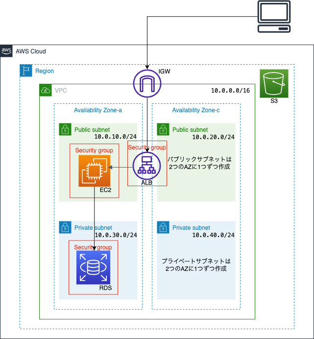
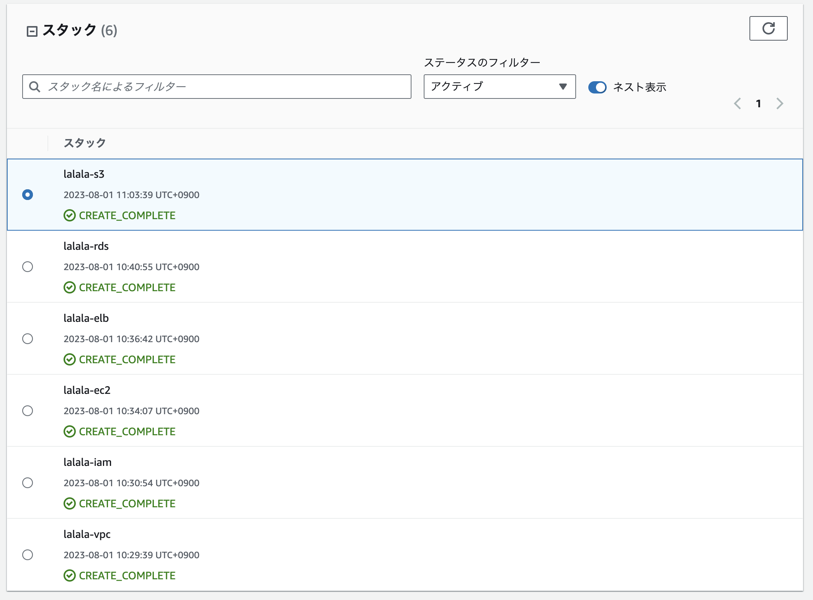

# Railsアプリケーションの実行環境構築　　
### 構成図

この構成図のアイコンは旧規格のものを使用しています。

## リソース
- VPC
    - DNSホスト名を有効化
- インターネットゲートウェイ　　
    - インターネットゲートウェイをVPCに紐付け
    - ルート先にインターネットゲートウェイを定義
    - ルートテーブルをパブリックサブネットに紐付け
- パブリックサブネット　　
    - 2つのAZに1つずつ作成
- プライベートサブネット　　
    - 2つのAZに1つずつ作成
- ELB（ALB）
    - EC2と同じセキュリティグループを使用
    - ELBをパブリックサブネットと紐付け
    - ELBターゲットグループを作成
    - ELBリスナーを作成し、ELBターゲットグループと紐付け
- EC2
    - インスタンスタイプはt2.microを使用
    - IAMインスタンスプロファイルを紐付け
    - 既存のキーペアを指定
    - セキュリティグループのインバウンドルールを設定
      - 22番(SSH)
      - 80番(HTTP)
      - 3000番(Rails)
- IAMロール　　
    - EC2がS3にアクセスするためのIAMロールを作成
    - IAMポリシー・IAMインスタンスプロファイルを作成し、IAMロールに紐付け
- RDS
    - パラメータでDBパスワードを設定
    - DBインスタンスクラスはdb.t2.microを使用
    - DBエンジンはMySQL(8.0.28)を使用
    - サブネットグループを作成し、プライベートサブネットと紐付け
    - セキュリティグループのインバウンドルールを設定
      - 3306番(MySQL)
    - パラメータグループを作成し、DBインスタンスと紐付け
- S3
    - S3バケットを作成

## Cloudformationリソース構築結果

