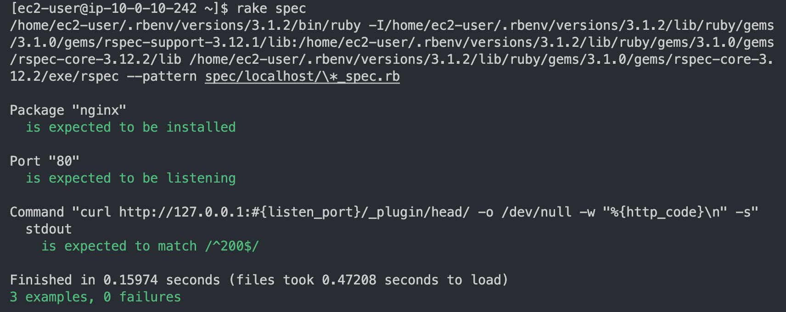

# Serverspec
### 概要
* Serverspecを使用してWEBサーバーのテストを実行する

## ファイル説明
* [/spec/lalala/sample_spec.rb](https://github.com/shino-taira/aws_practice/blob/main/serverspec/spec/lalala/sample_spec.rb)
  * 実際にテストする内容を記載するファイル
* [/spec/spec_helper.rb](https://github.com/shino-taira/aws_practice/blob/main/serverspec/spec/spec_helper.rb)
  * テストに関する全般的な設定ファイル
* [/Rakefile](https://github.com/shino-taira/aws_practice/blob/main/serverspec/Rakefile)
  * テスト実行のためのタスク定義ファイル
* [/.rspec](https://github.com/shino-taira/aws_practice/blob/main/serverspec/.rspec)
  * RSpecの挙動を設定するファイル

## テスト内容
  * Nginxのインストールを確認
  * 80番ポートの開放を確認
  * HTTPステータスコードが正常(200)であることを確認

## 手順
事前にrubyがインストールされていることが前提となります。
### Serverspcのインストール
```
$ gem install serverspec
```

### 初期設定
```
[ec2-user@ip-10-0-10-242 ~]$ serverspec-init
Select OS type:

  1) UN*X
  2) Windows

Select number: 1

Select a backend type:

  1) SSH
  2) Exec (local)

Select number: 2

 + spec/
 + spec/localhost/
 + spec/localhost/sample_spec.rb
/home/ec2-user/.rbenv/versions/3.1.2/lib/ruby/gems/3.1.0/gems/serverspec-2.42.2/lib/serverspec/setup.rb:155: warning: Passing safe_level with the 2nd argument of ERB.new is deprecated. Do not use it, and specify other arguments as keyword arguments.
/home/ec2-user/.rbenv/versions/3.1.2/lib/ruby/gems/3.1.0/gems/serverspec-2.42.2/lib/serverspec/setup.rb:155: warning: Passing trim_mode with the 3rd argument of ERB.new is deprecated. Use keyword argument like ERB.new(str, trim_mode: ...) instead.
 + spec/spec_helper.rb
 + Rakefile
 + .rspec
```
`Select a backend type:` について
* 今回はServerspecをインストールしたサーバ自身をテストするため、`2) Exec (local)`　を選択。
* ネットワーク経由で外部の複数のサーバに対してもテストを行う場合は、`1) SSH`　を選択する

### テスト項目記述
* [/sample_spec.rb](https://github.com/shino-taira/aws_practice/blob/main/serverspec/spec/lalala/sample_spec.rb)ファイルにテスト項目を記述

## テスト実行結果

